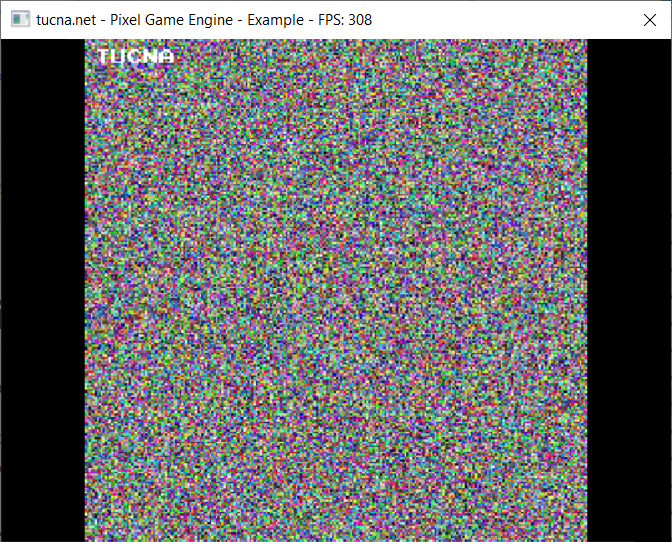

# tPixelGameEngine
Simple engine based on **Javidx9**'s `oclPixelGameEngine` - https://github.com/OneLoneCoder/olcPixelGameEngine

The biggest difference in comparisson with the original is *DirectX 11* based rendering instead of *OpenGL*. Because of that it is necessary to distribute shader binaries together with the engine file.

# Usage
Usage is the same as for the original version. You should add the header file from `engine` folder to your project and also you **must put there two shader files `vs.cso` and `ps.cso`**. After that you should write a new class, derive from `tDX::PixelGameEngine` and that is basically it. Check a code:

```cpp
#define T_PGE_APPLICATION
#include "tPixelGameEngine.h"

class Example : public tDX::PixelGameEngine
{
public:
  Example()
  {
    sAppName = "Example";
  }

public:
  bool OnUserCreate() override
  {
    // Called once at the start, so create things here
    return true;
  }

  bool OnUserUpdate(float fElapsedTime) override
  {
    // called once per frame
    for (int x = 0; x < ScreenWidth(); x++)
      for (int y = 0; y < ScreenHeight(); y++)
        Draw(x, y, tDX::Pixel(rand() % 255, rand() % 255, rand() % 255));

    DrawString(5, 5, "TUCNA");

    return true;
  }
};


int main()
{
  Example demo;
  if (demo.Construct(250, 250, 4, 4))
    demo.Start();

  return 0;
}

```

In your class overload `OnUserUpdate` method, in `main` create object, call `Construct` and `Start` in the end. That's all.

You can read original documentation [here](https://github.com/OneLoneCoder/olcPixelGameEngine/wiki).

# Screenshot
<p align="center">  
  
</p>

# License (OLC-3)
Copyright 2018, 2019 OneLoneCoder.com

Redistribution and use in source and binary forms, with or without modification, are permitted provided that the following conditions are met:

Redistributions or derivations of source code must retain the above copyright notice, this list of conditions and the following disclaimer.

Redistributions or derivative works in binary form must reproduce the above copyright notice. This list of conditions and the following disclaimer must be reproduced in the documentation and/or other materials provided with the distribution.

Neither the name of the copyright holder nor the names of its contributors may be used to endorse or promote products derived from this software without specific prior written permission.

THIS SOFTWARE IS PROVIDED BY THE COPYRIGHT HOLDERS AND CONTRIBUTORS "AS IS" AND ANY EXPRESS OR IMPLIED WARRANTIES, INCLUDING, BUT NOT LIMITED TO, THE IMPLIED WARRANTIES OF MERCHANTABILITY AND FITNESS FOR A PARTICULAR PURPOSE ARE DISCLAIMED. IN NO EVENT SHALL THE COPYRIGHT HOLDER OR CONTRIBUTORS BE LIABLE FOR ANY DIRECT, INDIRECT, INCIDENTAL, SPECIAL, EXEMPLARY, OR CONSEQUENTIAL DAMAGES (INCLUDING, BUT NOT LIMITED TO, PROCUREMENT OF SUBSTITUTE GOODS OR SERVICES; LOSS OF USE, DATA, OR PROFITS; OR BUSINESS INTERRUPTION) HOWEVER CAUSED AND ON ANY THEORY OF LIABILITY, WHETHER IN CONTRACT, STRICT LIABILITY, OR TORT (INCLUDING NEGLIGENCE OR OTHERWISE) ARISING IN ANY WAY OUT OF THE USE OF THIS SOFTWARE, EVEN IF ADVISED OF THE POSSIBILITY OF SUCH DAMAGE.
